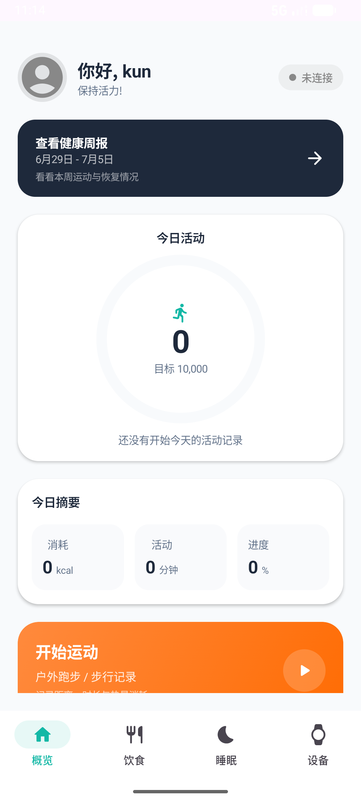
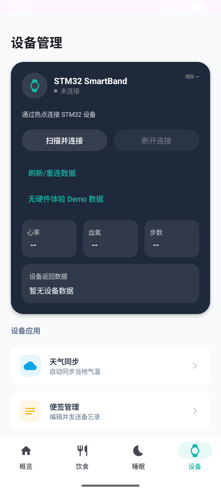
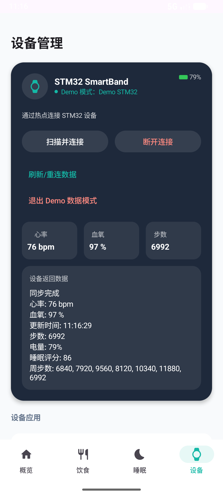
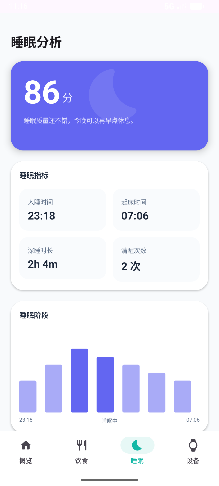

# Demo Screenshots

These screenshots were captured from the debug build running on an Android
emulator. The device and sleep screens use the hardware-free STM32 demo mode, so
reviewers can inspect the core health-data flow without physical hardware.

## Dashboard

The dashboard shows the main health summary, weekly activity trend, and quick
access to the app's core modules.

## Device Setup

The device page keeps the real STM32 hotspot/TCP path visible while also
offering a demo-data action for portfolio review.

## STM32 Demo Data

Demo mode simulates heart rate, blood oxygen, steps, battery, sleep score, and
weekly step data. This proves the downstream UI can be reviewed without pairing
the physical smart band.

## Sleep Analysis

The sleep page consumes demo vitals and displays a sleep score, timing metrics,
deep-sleep duration, wake count, and sleep-stage timeline.
